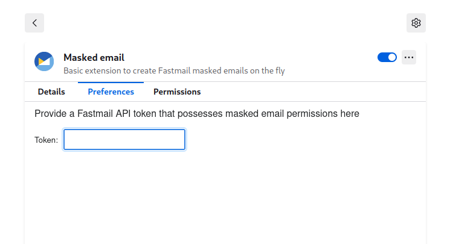

# Masked email extension

Simple web extension to create fastmail [masked emails][0].

## Installing

Install from here: https://addons.mozilla.org/en-US/firefox/addon/masked-email-extension/

## Getting started

1. Create a [Fastmail API token][1] that contains the `Masked Email` scope
1. Save your token in this extension's settings: 
1. Click on the extension button in the toolbar and fill out the form

[0]: https://www.fastmail.help/hc/en-us/articles/4406536368911-Masked-Email
[1]: https://www.fastmail.help/hc/en-us/articles/5254602856719
